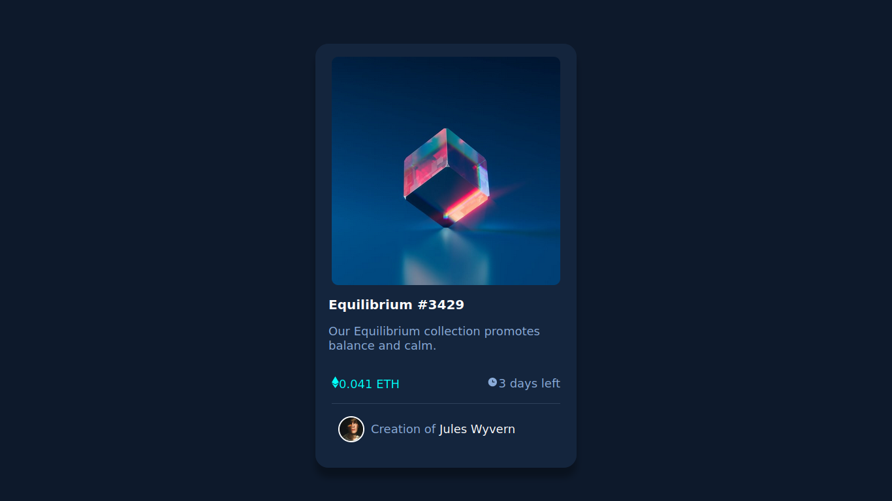
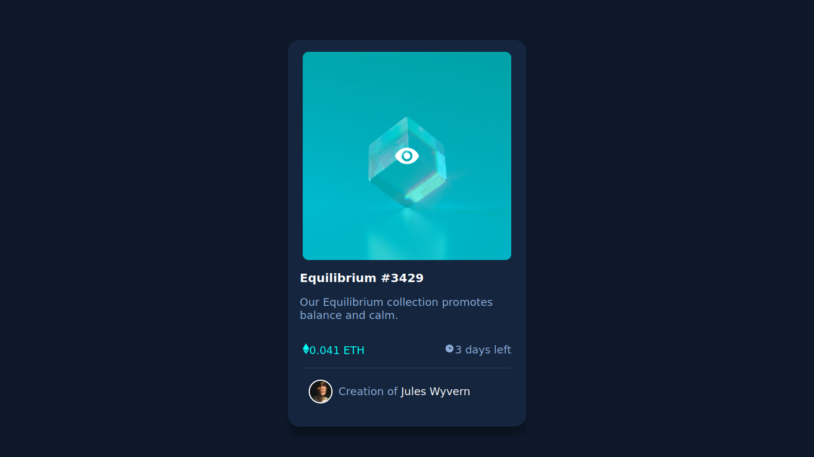

# Frontend Mentor - NFT preview card component solution

This is a solution to the [NFT preview card component challenge on Frontend Mentor](https://www.frontendmentor.io/challenges/nft-preview-card-component-SbdUL_w0U). Frontend Mentor challenges help you improve your coding skills by building realistic projects. 

## Table of contents

- [Overview](#overview)
  - [The challenge](#the-challenge)
  - [Screenshot](#screenshot)
  - [Links](#links)
- [My process](#my-process)
  - [Built with](#built-with)
- [Author](#author)

**Note: Delete this note and update the table of contents based on what sections you keep.**

## Overview

### The challenge

Users should be able to:

- View the optimal layout depending on their device's screen size
- See hover states for interactive elements

### Screenshot

### Links

- Solution URL: [Repository](https://github.com/ivandro-neto/interactive-rating-main.git)
- Live Site URL: [Interative Rating Main](https://ivandro-neto.github.io/interactive-rating-main/)

## My process

### Built with

- Semantic HTML5 markup
- CSS custom properties
- Grid system
- Flexbox
- Mobile-first workflow
- Javascript 

## Author

- Github - [Ivandro Neto](https://github.com/ivandro-neto)
- Frontend Mentor - [@ivandro-neto](https://www.frontendmentor.io/profile/ivandro-neto)
